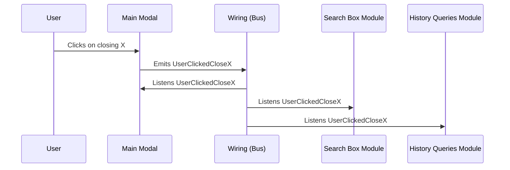

# X Components & the X Archetype

Workshop

<div class="flex justify-center">


</div>

---

# Overlay vs X Components

Overlay was the first solution for the frontend by Empathy.co, we have walked a long way since then

-  **Mantainability** - Overlay was created as a stop-gap and with little time for planning how to scale the application
-  **Scalability** - X Components had more time to plan and design the architecture, so we were able to have scalability in mind this time around
-  **Modular** - We moved from config files to a more developer-friendly approach of modular components
-  **Lightweight** - A main friction point with Overlay and previous frontend solutions was the bundle size and the initial loading times of the pages, X Components, thanks to being modular, allows for customization of what components are used and added to the bundle
-  **Tree Shaking** - Better bundling tools allows X Components to remove from the bundle code that is not used in the setups, saving more loading time
-  **Faster development** - With the inclusion of the Design System, better testing and a more developer-friendly project, the setups for the clients are done much quicker.

<!--
-->

---

# Tech Stack

<v-clicks>

* **Development**
  * Typescript
  * Vue 2.7
  * Tailwind
* **Bundling**
  * Rollup
  * Vite
  * Webpack
* **Testing**
  * Jest
  * Cypress
  
</v-clicks>

<!--
Mainly Rollup
-->

---

# The X Monorepo

The X Components live inside the X monorepo. All the packages interact with each other, so it's important to understand how they are structured.

<br>

### Relevant Packages

|                  |                                                                                          |
|------------------|------------------------------------------------------------------------------------------|
| Adapter          | library of utils to ease the communication with any API                                  |
| Platform Adapter | pre-made adapter to communicate with Empathy.co API                                      |
| Bus              | library that provides an event bus for event orchestration                               |
| X Components     | library of components aimed to create search experiences                                 |
| Tailwind         | tailwind plugin for of the X Components Design System                                    |
| Translations     | contains utilities to convert csv with translations to JSON for the i18n in X Components |

<!--
* There are other packages that provide utilities, typings, etc that we will cover briefly during the workshop
* Other relevant package is the X Archetype but it's its own repository outside of the monorepo
-->

---

# The X Components

---

## The Structure in X Components

The X Components package 

<div grid="~ cols-2 gap-4">
  <div>

<v-clicks>

* Components directory
  * General purpose components
  * Animations
  * Icons
  * Decorators
  * Scroll
* Modules
* Services
* Composables
* Demo views

</v-clicks>

  </div>
  <div>


  </div>
</div>

<!--
* Components directory: Modular components, intended to be used across all the app
  * General purpose components that don't fit in the modules directory
  * Animations are usually intended to be passed ass a prop
  * Icon components here follow a specific structure to work with the DS, the package SVG Converter transforms SVG to Vue component with this structure
  * We have a couple of decorators to add functionalities to some components. Listening to events from the bus with XOn, decorators for provide/inject and for accessing the store. This decorators must be used with the vue-class-component library
* Modules: Folder for each one of the main functionalities of the search experience. Each one has its own store module, event handling (wiring) and components
* Services: State machine and directional focus navigation
* Composables: Code that uses reactivity. They're intended to be imported in any component. Device and use$x
* Demo Views: A collection of pages to explore different functionalities of the X Components

-->

---

# Base Components

<v-clicks>

* Animations
* Base
* Decorators
* Icons
* Modals
* Result

</v-clicks>

---

## Animations

<div grid="~ cols-2 gap-4">
  <div>

Animations are components that just render their slot wrapped by a Vue `transition` and apply the animation styles to it.

There are many component that accept Animation components as props. 
  </div>

  <div>

```html {all|1|2-3|all}
<transition v-on="$listeners" name="x-animation-" v-bind="$attrs">
  <!-- @slot (Required) Transition content -->
  <slot />
</transition>
```
<br />

```html {all|1}
<component :is="animation">
  <div
    v-show="isOpen && hasContent">
  // ...
  </div>
</component>
```

  </div>
</div>

<!--
Clicks:
* The transition setting up the listener, attributes and the name
* Content that will be wrapped

* Usage with a dynamic component
* Transition trigger
-->

---

## Base

<div grid="~ cols-2 gap-4">
  <div>

"Base" components are minimal components aimed to be used as building blocks for more complex components.

They're used across all the modules and are not coupled to any of them.

Can be imported and implemented by themselves too.

  </div>

  <div>

`base-event-button.vue`

```html {all|2-3|1|all}
<button v-on="$listeners" @click="emitEvents">
  <!-- @slot (Required) Button content with a text, an icon or both -->
  <slot />
</button>
```
<br />

`clear-filters.vue`

```html {all|1,10|9|6|2-4,5,7}
<BaseEventButton
  v-if="isVisible"
  class="x-clear-filters x-button"
  data-test="clear-filters"
  :disabled="!hasSelectedFilters"
  :events="events"
  :class="cssClasses"
>
  <slot :selectedFilters="selectedFilters">Clear Filters ({{ selectedFilters.length }})</slot>
</BaseEventButton>
```

  </div>
</div>

<!--
Clicks:
* Content of the button
* Action of the button, emitting events
* Example of usage
* Content, saying that the button will clear the selected filters
* Events that will be triggered
* Other properties normal of a button
-->

---

## Decorators

<div grid="~ cols-2 gap-4">
  <div>

Decorators are special helpers that provide functionality or modify the behavior of other functionalities.

They're similar to the composables or the mixins.

They need the vue 2 library `vue-class-components` and `vue-property-decorators` to work, and don't work with the new Vue 3 syntaxis
  </div>

  <div>

```ts {all|1|2|all}
@XProvide('filters')
public get filtersWithResults(): Filter[] {
```
<br />

```ts {all|1|2}
@XInject('filters')
public injectedFilters!: Filter[];
```

  </div>
</div>

<!--
* Examples of custom decorators
* X Provide is a reactive provide for Vue 2
* In this case it provides filters with results to components under it
* X Inject is a reactive inject for Vue 2
* It receives the filters
-->

---

## Icons

<div grid="~ cols-2 gap-4">
  <div>

Icons in the X Components are set up as Vue components.

For they to work with the X Design System they have to follow a structure. The package `x-svg-converter` has a utility to convert from SVG to a X Components-ready Vue component.

  </div>

  <div>

```html {all|1|3|5|10,17}
<template functional>
  <svg
    :class="['x-icon'].concat(data.staticClass, data.class)"
    viewBox="0 0 8 8"
    fill="none"
    xmlns="http://www.w3.org/2000/svg" 
  >
    <path 
      d="M1.5 4H6.24683"
      stroke="currentColor"
      stroke-width="0.4"
      stroke-linecap="round"
      stroke-linejoin="round"
    />
    <path 
      d="M4 6.5L6.5 4L4 1.5"
      stroke="currentColor"
      stroke-width="0.4"
      stroke-linecap="round"
      stroke-linejoin="round"
    />
  </svg>
</template>
```

  </div>
</div>

<!--
Clicks:
* Functional component
* Adds the x-icon class and the classes passed to it
* Specifies the fills to none by default
* Stroke and fills that are specified are set to currentColor
-->

---

## Modals

<div grid="~ cols-2 gap-4">
  <div>

Modals are panels that will overlap the page when opened to show it's content. An overlay will also obscure the content behind the modal.

Think things like the filters panel or the sorting in mobile.

Modals in X Components can listen to events for opening and closing from anywhere within the app.

  </div>

  <div>

`base-events-modal.vue`
```html {all|8|4,6|5|2-3|all}
<BaseModal
  @click:overlay="emitBodyClickEvent"
  @focusin:body="emitBodyClickEvent"
  :animation="animation"
  :open="isOpen"
  v-bind="$attrs" 
>
  <slot />    
</BaseModal>
```

```ts {all|1-2|3-4|all}
@Prop({ default: (): XEvent[] => ['UserClickedOpenEventsModal'] })
public eventsToOpenModal!: XEvent[];
@Prop({default: (): XEvent[] => ['UserClickedCloseEventsModal', 'UserClickedOutOfEventsModal']})
public eventsToCloseModal!: XEvent[];
```

```ts {all|1-3|4-6}
@XOn(component => (component as BaseEventsModal).eventsToOpenModal)
  openModal(_payload: unknown, metadata: WireMetadata): void {}
}

@XOn(component => (component as BaseEventsModal).eventsToCloseModal)
  closeModal(): void {}
}
```

  </div>
</div>

<!--
Clicks:
* Slot for the content in the modal
* Animation as prop and binding of attributes
* isOpen, controlled by the events
* Emit events for actions of click and focus
* Props for events to open
* And close
* Listening events to open
* And close
-->

---

## Result

<div grid="~ cols-2 gap-4">
  <div>

There's no pre-made result component in X-Components.

A result component will be made in the setup itself (Archetype) by combining the pieces available as base components.

This allows for more modularity and flexibility when approaching a setup.

  </div>

  <div>

```html {all|1,10|2,4|3|5,9|6|7-8}
<MainScrollItem>
  <BaseResultLink>
    <BaseResultImage />
  </BaseResultLink>
  <BaseResultLink>
    { result.description }
    <BaseResultCurrentPrice />
    <BaseResultPreviousPrice />
  </BaseResultLink>
</MainScrollItem>
```

  </div>
</div>

<!--
Clicks:
* Main scroll item to control the scroll on url load
* Result link (link to the product page)
* Image of the result
* Result link again
* The description
* The result prices for sale prices
-->

---
layout: two-cols
---

<template v-slot:default>

# Modules

- `device`
- `empathize`
- `extra-params`
- `facets`
- `history-queries`
- `next-queries`
- `popular-searches`
- `queries-preview`
- `query-suggestions`

</template>

<template v-slot:right>

# &nbsp;

- `recommendations`
- `related-tags`
- `scroll`
- `search`
- `search-box`
- `semantic-queries`
- `tagging`
- `url`

</template>

<!--
* The modules are the core functionalities of the project
* Tasked with communicating with the endpoints and set the store values
* Communicate with each other and the application with the wiring
* Some modules have their own components to visualize the data in their stores or interact with the rest of the application
-->

---

# Wiring


The wiring is the event system that the X Components use to communicate between each other.

Each X Components module has its own wiring to listen to events emitted across all the application and trigger actions from the module itself.

Multiple modules can listen to the same event and react to it.

The wiring of the modules is fully customizable from within a client setup, so you can add/remove/expand listeners and actions of any module.

---

## Wiring flow example

<br />



<!--
* Modal is closed
* Query is cleared
* HQ are cleared
-->

---

## Empathize Module

<br />

### What?

The Empathize is a modal-like container intended to show search suggestions to the user.

### Why?

It's a module because it's a core part of the search experiences, normally pared with the action of searching. Many behaviors of the application depend on checking if the Empathize is open or not, so the module provides that information.


<!--
* Usually shown when focus on the search box.
* Idea is for the user to have easy access to products and suggested queries while typing their query or about to search
* Mostly a container
-->

---

### How?

The main component for the empathize is a modal panel to render the other components in. It's coupled to the events that update the module's store status.

```html {all|1,11|3|4-5|7-9|all}
<component :is="animation">
    <div
        v-show="isOpen && hasContent"
        @focusin="open"
        @focusout="close"
    >
        <slot>
            <span ref="noContent" hidden aria-hidden="true" />
        </slot>
    </div>
</component>
```

```ts {all|1-2|3-4|6-7|all}
@Prop({ default: ... })
protected eventsToOpenEmpathize!: XEvent[];
@Prop({ default: ... })
protected eventsToCloseEmpathize!: XEvent[];

// Triggered on open or close
changeOpenState(newOpenState: boolean, metadata: WireMetadata): void {
```

```html {None|all}
<Empathize>
    <YourCustomSuggestions />
</Empathize>
```

<!--
Clicks:
* Animation for the Empathize
* Control open and close
* Modal behavior (focus in -> open, focus out -> close, etc)
* Slot for the content
* Prop events to open
* Prop events to close
* Method that trigger when the empathize opens or close. Emits events
* Usage
-->

---

## Empathize Exercise

<br />

<div grid="~ cols-2 gap-4">
  <div>

1. Open the empathize when the button is clicked
2. Empathize contains a title with the text `Suggestions` and a component `CustomSuggestions`
3. The empathize should be animated
4. Emit the event `CustomCloseEvent` when empathize closes

  </div>
  <div>

```html
<Empathize />
<BaseEventButton>
    Open Empathize
</BaseEventButton>
```

  </div>
</div>

<br />

<div class="hide-click">

```html {None|all}
<Empathize :animation="fade" :eventsToOpenEmpathize="['CustomOpenEmpathize']">
  <template>
    <h1>Suggestions</h1>
    <CustomSuggestions />
  </template>
</Empathize>
<BaseEventButton :events="['CustomOpenEmpathize']">
  Open Empathize
</BaseEventButton>
```

</div>

<Timer :minutes="3" />

<!--
* Import the animation and then define a constant for it to pass as prop
* Events should be of type XEvent but it's simplified for the exercise
-->

---

## Extra Params Module

<br />

### What?

This module contains a collection of params that will be sent in all the requests.
These params can be set via snippet config or programatically.

### Why?

Sometimes requests to the endpoints require extra data that doesn't fir in the regular requests parameters. This module allows this data to be provided where is required or changed programatically

### How?

The components in this module are used to propagate the extra params to the rest of the application and stores.
A renderless component that sets the values of the Extra Params is the main component of the module.

```ts {all|1-2|4-7}
@Prop({ required: true })
public values!: Dictionary<unknown>;

created(): void {
  this.$x.emit('ExtraParamsInitialized', { ...this.values });
  this.$x.emit('ExtraParamsProvided', { ...this.values, ...this.storeExtraParams });
}
```

<!--
* Mostly tied to tagging and stores/language
* Works closely with the snippet config

Clicks:
* Prop for the extra params values
* Events to update the store
-->

---

## Extra Params Exercise

<br />

1. Make requests send a parameter called `MyParameter` with a value `'MyValue'`

<div class="hide-click">

```html {None|all}
<ExtraParams :values="{
  MyParameter: 'MyValue'
}" />
```

</div>

<Timer :minutes="1" />

---

## Facets Module

<br />

<div grid="~ cols-2 gap-4">
  <div>

### What?

The Facets module stores and controls everything related to the filtering in the requests.

### Why?

Filtering is a very important part of any search experience, we needed clear ways of managing what the filtering options are, how to show them, make them accesible to other modules, etc

### How?
The wiring of the module handles events that changes the state facets directly or requires it to change
The `facets` component renders the list of the components, depending of the type. 
There are also individual components to render the different types of filters in the facets and list components to help when rendering the list of filters (adds search, collapse, etc).

  </div>
  <div class="flex justify-center">


  </div>
</div>

<!--
* Filters can be of many different types
  * Simple
  * Hierarchical
  * Range
* Selected filters are added to the request
* The `Facets` component is used to render the list of facets and their filters. It has some functionalities to communicate with the store and customize the facets to show, but the main thing with this component are the dynamic slots. These slots are used to customize how different facets are rendered.
* The filters components aim to have basic rendering options for these different types of filters.
-->

---

`Facets.vue`
```html {all|2|4-5|7-8|10-14|all}
<li 
  v-for="({ facet, slotNameById, slotNameByModelName }, facetId) in mappedFacets"
>
  <slot v-if="$scopedSlots[slotNameById]"
    v-bind="{ facet, selectedFilters: selectedFiltersByFacet[facetId] || [] }"/>
  
  <slot v-else-if="$scopedSlots[slotNameByModelName]" 
    v-bind="{ facet, selectedFilters: selectedFiltersByFacet[facetId] || [] }"/>
  
  <slot v-else
    v-bind="{ facet, selectedFilters: selectedFiltersByFacet[facetId] || [] }"
  >
    This is the {{ facet.label }} facet. Pass something into its slot to display content.
  </slot>
</li>
```

`simple-filter.vue`
```html {all|1,7|2,6|3-5}
<RenderlessFilter v-slot="{ filter, clickFilter, cssClasses, isDisabled }" :filter="filter">
  <slot v-bind="{ filter, clickFilter, cssClasses, isDisabled }">
    <button @click="clickFilter">
      <slot :filter="filter" name="label">{{ filter.label }}</slot>
    </button>
  </slot>
</RenderlessFilter>
```

<!--
Minimized Facets and filter component.
Clicks:
* Iteration of the facets that will be rendered
* Custom slot for a facet by facet ID. A slot is created for each facet id in the `mappedFacets`
* Custom slot for a facet by model name. A slot is created for each facet model name in the `mappedFacets`
* Default slot for a facet. Fallback
* Exposes bindings from the slot. Renderless in case there's something wrong
* Slot for the filter content with the bindings
* A customizable button
-->

---

## Facets Exercise

<br />

<div grid="~ cols-2 gap-4">
  <div>

1. All the facets use a dynamic slots
2. The filters of the facet of type `HierarchicalFacet` uses the filter component of `hierarchical-filter`
3. The filters of the facet of id `identifiableFacet` should show just the name of the filter

  </div>
  <div>

```ts
facetsInStore = [{
    id: 'identifiableFacet',
    label: 'identifiableFacet',
    modelName: 'SimpleFacet',
    filters: [...]
  },
  {
    id: 'hierarchicalFacet',
    label: 'Hierarchical Facet',
    modelName: 'HierarchicalFacet',
    filters: [...]
  }];
```

  </div>
</div>

<div class="hide-click">

```html {None|all}
<Facets>
    <template #identifiableFacet="{ facet, selectedFilters }">
      <FiltersList v-slot="{filter}">
        {{ filter.label }}
      </FiltersList>
    </template>
    <template #hierarchical-facet="{ facet, selectedFilters }">
      <FiltersList v-slot="{filter}">
        <HierarchicalFilter :filter="filter" />
      </FiltersList>
    </template>
</Facets>
```

</div>

<Timer :minutes="4" />

---

## History Queries Module

<br />

<div grid="~ cols-2 gap-4">
  <div>

### What?

Module containing the queries already searched by the user.

### Why?

We need a module here to handle of all the logic for suggesting past queries, storing in `LocalStorage`, what queries are stored ot not, My History, etc.

### How?

Basic approach for the module is a list of the suggestions coming from the history queries store. There are already two components to help with this, `history-queries` and `history-query`.

  </div>
  <div class="flex justify-center">


  </div>
</div>  

<!--
Why:
* On top of it, given the privacy focus of Empathy, and given that past queries are considered sensible information, there's also logic to remove and even opt-out of storing user's history queries.
How:
* There's ample customization options for these components through slots.
-->

---

`history-queries.vue`
```html {all|1,16|3-14|4,13|5-7|8-12|all}
<BaseSuggestions v-bind="$attrs" :suggestions="historyQueries">
  <template #default="baseScope">
    <slot name="suggestion" v-bind="{ ...baseScope }">
      <HistoryQuery :suggestion="baseScope.suggestion">
        <template #default="historyQueryScope">
          <slot name="suggestion-content" v-bind="{ ...baseScope, ...historyQueryScope }" />
        </template>
        <template #remove-button-content="removeHistoryQueryScope">
          <slot name="suggestion-remove-content" 
                v-bind="{ ...baseScope, ...removeHistoryQueryScope }"
          />
        </template>
      </HistoryQuery>
    </slot>
  </template>
</BaseSuggestions>
```

<!--
Simplified components
Clicks:
* Heavy use of base components. In this case `base-suggestions` and `base-suggestion`
* All the content can be customized
* `HistoryQuery` is just a `base-suggesiton` and a remove button to clear it from the store. The slots have the suggestion info exposed.
* Slot for the history query (normally the text of the query being suggested)
* Slot for the remove button
Other components in the model to opt-out
My History is an specialized component about query historic data, more specialized and aimed to power users
-->

---

## History Queries Exercise

<br />

1. Use `history-queries` component
2. Have the `history-query` suggested have the part matching the current query highlighted
3. The remove button should be a minus icon

<div class="hide-click">

```html {None|all}
<HistoryQueries>
  <HistoryQuery
    class="x-suggestion-group-md"
    :suggestion="suggestion"
    suggestionClass="x-suggestion x-suggestion-md"
  >
    <template #default="{ query }">
      <Highlight :text="suggestion.query" :highlight="query" />
    </template>
  
    <template #remove-button-content>
      <Minus class="x-icon-md" />
    </template>
  </HistoryQuery>
</HistoryQueries>
```

</div>

<Timer :minutes="4" />

---

## Identifier Results Module

<br />

### What?

Module containing the results of a search by identifier, a special search for querying by product id

### Why?

Retrieves results for the queries from a specific endpoint (through an adapter), requiring configurations for things like items to request, debounce time and, most importantly, the regex expression that activates the identifier search.


### How?

If the query being typed matches with the regex configured in the module a request to the identifier search is made.
The response of that request is loaded in the module as Results.

The components in the module are straight-forward rendering list for the list of identifier results and rendering component for the name of the result.

<div class="flex justify-center">


</div>

<!--
No exercise, same approach as other list-component pairings for X Components
Module behavior and adapter logic are the important part
-->

---

## Next Queries Module

<br />

### What?

Module to handle Next Queries, terms usually searched by the users after the current query.

### Why?

The next queries are requested in its own endpoint through the adapter and the module stores the results.
On top of the next query terms, the module can also request and store a preview of what the results of requesting that term would be.

<div class="flex justify-center">


</div>

<!--
* Usually scattered in the results grid
* Normally displayed as a sliding panel of results or a list of queries
-->

---

### How?

The `next-queries` and `next-query` components follow a similar approach of using `base-suggestions` for the listing and `base-suggestion` for the individual elements that we saw previously.

To take advantage of the preview results for each next query there's also the component `next-query-preview`, that displays the results preview for a next query suggestion.

```html {all|1,18|2-6,17|7-12,16|13-15}
<ul v-if="suggestionResults">
  <slot
    :suggestion="suggestion"
    :results="suggestionResults.items"
    :totalResults="suggestionResults.totalResults"
  >
    <li
      v-for="result in suggestionResults.items"
      :key="result.id"
      class="x-next-query-preview__item"
      data-test="next-query-preview-item"
    >
      <slot name="result" :result="result">
        <span data-test="result-name">{{ result.name }}</span>
      </slot>
    </li>
  </slot>
</ul>
```

<!--
Component receives a Next Query suggestion as prop
Clicks:
* Iterate the result previews of the passed next query from the store
* Slot for the content of the list, exposing the suggestion, results preview and number of results of the query
* Iterate through the results previews that we want to render
* This element also has a slot to customize how each preview is rendered
-->

---

## Next Queries Exercise

<br />

1. Show the preview of a next query
2. Each next query should render a maximum of 5 result previews
3. Previews should be contained inside an `sliding-panel` component
4. Title in the `sliding-panel` should link to a search of the next query
   **Hint**: Use the `items-list` component and a made-up `result` component that receives a result as prop to list the previews

<div class="hide-click">

```html {None|all}
<NextQueryPreview
  #default="{ results, totalResults, suggestion }"
  :suggestion="nextQuery"
  :maxItemsToRender="5"
>
  <SlidingPanel>
    <template #header>
      <NextQuery :suggestion="nextQuery">
        {{ suggestion.query }}
      </NextQuery>
    </template>
    <ItemsList :items="results">
      <template #result="{ item: result }">
        <Result :result="result" />
      </template>
    </ItemsList>
  </SlidingPanel>
</NextQueryPreview>
```

</div>

<Timer :minutes="4" />

---

## Popular Searches Module

<br />

### What?

Module to handle the requesting and storing of popular searches, suggestions from it's own endpoint that return the most searched terms of the store.

### Why?

Being it's own endpoint (managed by an adapter) and having that information accessible through the store across all the app is important when dealing with
terms that are likely to be clicked by the user.

### How?

Popular searches can be requested at any time as they don't depend on the current query. The wiring handles when to request them and the module stores them. Once again, a pair of components based on `base-suggestions` and `base-suggestion` are enough to render the information in this module anywhere in the app.

<div class="flex justify-center">


</div>

---

## Queries Preview Module

### What?

This module is used to preview requests to the search endpoint.
It exposes components that allow to retrieve the results for any arbitrary query.

### Why?

The module does a specific request to the search endpoint and stores the response. The specifics of the request are configurable, so having
them stored in the module so they're customizable and easily edited is a core part of the intent of the module

<div class="flex justify-center">


</div>

<!--
* Usually, the configuration of what queries are previewed is done via the snippet config
-->

---

### How?

The Component `query-preview` is tasked with rendering and triggering the request to the endpoint when it's created. The props to the component and
the config in the module store shape the request to the search endpoint and once the results come from the response they're displayed

```html {all|1,20|2-6,19|7-13,17-18|14-16}
<NoElement v-if="queryPreviewResults && queryPreviewResults.totalResults">
  <slot
    :query="query"
    :results="queryPreviewResults.results"
    :totalResults="queryPreviewResults.totalResults"
  >
    <ul data-test="query-preview" class="x-query-preview">
      <li
        v-for="result in queryPreviewResults.results"
        :key="result.id"
        class="x-query-preview__item"
        data-test="query-preview-item"
      >
        <slot name="result" :result="result">
          <span data-test="result-name">{{ result.name }}</span>
        </slot>
      </li>
    </ul>
  </slot>
</NoElement>
```

<!--
Clicks:
* Renders the component if there're results to show
* Slot to customize with accessible info
* List of the results to show
* Slot to customize how each result is rendered

There's other component to handle a list of query previews and the logic behind it.
-->

---

## Queries Preview Exercise

<br />

1. Use the `query-preview-list` component
2. Show this previews only if there's no query currently. **Hint**: Use `$x`
3. Provide the query preview info externally. **Hint**: Check the `queriesPreviewInfo` type
4. Use a made-up `result` component that receives a result as prop to list the previews

<div class="hide-click">

```html {None|all}
<QueryPreviewList
  v-if="!$x.query.searchBox && queriesPreviewInfo"
  :queries="queries"
  #default="{ results }"
>
  <Result
    v-for="result in results"
    :key="result.id"
    :result="result"
  />
</QueryPreviewList>
```

```ts {None|all}
@XInject('queriesPreviewInfo')
public queriesPreviewInfo!: QueryPreviewInfo[];

protected get queries(): string[] {
  return this.queriesPreviewInfo.map(item => item.query);
}
```

</div>

<Timer :minutes="3" />

---

## Query Suggestions Module

<br />

<div grid="~ cols-2 gap-4">
  <div>

### What?

It handles all the suggestions given to the user while he is typing on the search box.

### Why?

Autocomplete is part of any worthwhile search experience. A dedicated endpoint takes care of receiving the query and returning the suggestions.
The module stores them and handles the config for the requests

### How?

The module's wiring checks when the user is typing a query to send the requests and store them in the store. Like with other suggestion modules, two components using `base-suggestions` and `base-suggesiton` handle the rendering.

  </div>

  <div class="flex justify-center">
  

  
  </div>
</div>

---

## Recommendations Module

<br />

### What?

Module for recommendations that are the most clicked products.

### Why?

Similar principle to the popular searches module, the recommendations are likely to be clicked by the user and are not bound to a specific part of the website.
The dedicated endpoint returns the recommendations and result objects and the form of the request depends on the configuration in the module.

### How?

The idea is requesting the recommendation right away because the request is not expected to change. The module has a component to render the list of recommendations
as results in a simple way.

<div class="flex justify-center">


</div>

---

## Related Tags Module

<br />

### What?

Suggestions of keywords to compliment the current query.

### Why?

The module needs to store the related tags, store the selected suggestions and make request calls through its specific adapter.

### How?

The Related Tags depend entirely of the query, so when a query is accepted the request for the tags will be made and the response stored.
They are treated as buttons instead of suggestions, so the components for rendering are a regular list of buttons, but the customization options with slots are very similar.

<div class="flex justify-center">


</div>

---

## Related Tags Exercise

<br />

1. Render related tags within a sliding panel
2. The related tag should render its text
3. If the related tag is selected it should have a minus icon in the right
4. If the related tag is not selected it should have a plus icon in the right
5. If the related tag is curated it should have a curated check icon icon in the left

<div class="hide-click">

```html {None|all}
<SlidingPanel v-if="$x.relatedTags.length">
  <RelatedTags :highlightCurated="true">
    <template #related-tag-content="{ relatedTag, isSelected, shouldHighlightCurated }">
      <CuratedCheckIcon v-if="shouldHighlightCurated" />
      {{ relatedTag.tag }}
      <CrossTinyIcon v-if="isSelected" />
      <PlusIcon v-else />
    </template>
  </RelatedTags>
</SlidingPanel>
```

</div>

<Timer :minutes="4" />

---

## Scroll Module

<br />

### What?

This module handles the state of the scroll.
It is in charge of restoring the scroll position, and it contains info related to the scroll in the page, such as the scroll direction, if the user is near the end of the page, etc.

### Why?

This module stores the data of any scroll that uses a scroll X Component in a dictionary in the module's store. This is so its current position can be restored (the module tracks the id of the current element in the scroll's view) and so it can rely the information about its position relative to the start or the end of the scrolling space.

### How?

The `scroll` component is the backbone of the module. It uses the `base-scroll` component and it's the one communicating with the module through events, to use it is enough to wrap the components that you want to apply the scroll to. Aside from the utility components in the module the other parts that are important are the `main-scroll` and the `main-scroll-item`.

The `main-scroll` is an extended `scroll` component that adds the functionality of tracking the current component in view so the scroll position can be restored if the page is loaded from the URL, the `main-scroll-item` adds the ids and the tracking communication to the components they wrap.

---

`scroll.vue`
```html {all|1,11|2-9|10|all}
<BaseScroll
  @scroll="emitScroll"
  @scroll:direction-change="emitScrollDirectionChange"
  @scroll:at-start="emitScrollAtStart"
  @scroll:almost-at-end="emitScrollAlmostAtEnd"
  @scroll:at-end="emitScrollAtEnd"
  v-on="$listeners"
  :id="id"
  v-bind="$attrs">
  <slot />
</BaseScroll>
```

`main-scroll-item.vue`
```ts {all|1-2|3-4|6-7|9-12}
@Prop({ required: true })
public item!: Identifiable;
@Prop({ default: () => NoElement })
public tag!: string | typeof Vue;

@XInject(ScrollObserverKey)
public firstVisibleItemObserver!: ScrollVisibilityObserver | null;

async mounted(): Promise<void> {
  await this.$nextTick(); // Mounted does not guarantee that child components are mounted too
  this.$watch('firstVisibleItemObserver', this.observeItem, { immediate: true });
}
```

<!--
Clicks:
* Extends the `BaseScroll`
* Emits every scroll event so the module picks up the information and the `id` for the dictionary in the module
* slot

* Item with an ID as the prop (usually the result itself)
* The kind of component that will be wrapping the slot
* The observable coming from an scroll element (`main-scroll`)
* Sets the observable that is tracking the visible element in the scroll
-->

---

## Scroll Module Exercise

<br />

1. Have a scroll using `main-scroll`
2. List the results with `results-list`
3. Have the results be `main-scroll-item` article
4. Use a made-up `result` component that receives a result as prop to list the previews

<div class="hide-click">

```html {None|all}
<MainScroll>
  <Scroll id="main-scroll">
    <ResultsList>
      <MainScrollItem :item="result" tag="article">
        <Result :item="result" />
      </MainScrollItem>
    </ResultsList>
  </Scroll>
</MainScroll>
```

</div>

<Timer :minutes="3" />

---


## Search Module

<br />

### What?
The search module contains the results for the current query, as well as several components used to show the results, modify the sort, render the spellchecked query, etc.

### Why?
It handles everything related to the request to the search adapter. It's the endpoint that returns most information and influencing more functionalities across the setup.

<div class="flex justify-center">


</div>

---

### How?
When a new request through the search adapter is needed (user accepted a query for example) the module sends the requests and stores the response. The endpoint will store things like all the result types (regular, promoted, banners, etc),
the number of results, keep track of the pagination, the facets that will be used by the facets module, etc. Some of that data will be consumed in other parts of the setup and other will be handled by the search module itself.

The main task of the components inside the module is the rendering of results and similar elements. There are lists or individual components for almost each of these objects. This is because, normally, we want to style each type differently from the rest and each has a different structure.

**Result**, **Banner** **Promoted**, **Partial**

When creating a setup normally we want a single list (grid) that contains all these elements (results, promoted, etc) but each with each own rendering strategy. To accomplish this, the list components in the module can work from within each other.
The `result-list` can wrap any other list of the module, and it will render the results plus the elements of that list, and the next list that gets wrapped within will do the same. Lastly, the way each type of element will render is determined by the named slots in the last chained list.

<!--
* **Result**: Regular result that represents a product with all the information (name, description, pricing, image, etc). Module doesn't have a default rendering component for this one, the idea is to create one from base components in a setup by setup basis.
* **Banner**: Intended as an advertisement within the results. Components will represent it as a large image maybe spanning multiple rows that links to the url
* **Promoted**: Similar to the Banner but more intended to blend within the normal results and in a highlighted position. Represented almost as a regular product, but in this case the pricing is not part of the model
* **Partial**: Partials appear when the query has low results and can be split in other more relevant queries (red iphone dress -> red iphone | red dress). The module will have a list of partial queries and each will have some results of the query, similar to how the queries preview did it. The rendering is similar to the queries preview too (a list of results with a clickable title to redirect to the query).

The chained lists work because they get injected the elements to render from the previous list
-->

---

`banner.vue`
```html {all|1,2,9|3|4-5,7|8|all}
<component
  :is="banner.url ? 'a' : 'figure'"
  v-if="!imageFailed"
  v-on="banner.url ? anchorEvents() : {}"
  :href="banner.url"
>
  
  <h2 v-if="banner.title"> {{ banner.title }} </h2>
</component>
```

`promoted.vue`
```html {all|1,6|2-5}
<a @click="emitClickEvent" :href="promoted.url">
  
  <h2 class="x-promoted__title">
    {{ promoted.title }}
  </h2>
</a>
```

<!--
Clicks:
* Dynamic component
* Image is most important part for the banner
* Handling the url
* Title is optional
* Simpler, a regular anchor
* With an image and title
-->

---

`results-list.vue`
```html {all|2,8|3,7|4,6|5|all}
<NoElement>
  <slot v-bind="{ items, animation }">
    <ItemsList :animation="animation" :items="items">
      <template v-for="(_, slotName) in $scopedSlots" v-slot:[slotName]="{ item }">
        <slot :name="slotName" :item="item" />
      </template>
    </ItemsList>
  </slot>
</NoElement>
```

`items-list-injection.mixin.ts`
```ts {all|1|3-6|8-9}
protected stateItems!: ListItem[];

@XProvide(LIST_ITEMS_KEY)
public get items(): ListItem[] {
  return [];
}

@XInject(LIST_ITEMS_KEY)
public injectedListItems: ListItem[] | undefined;
```

<!--
All the list for these elements in the module follow this structure
Clicks:
* Slot to be overriden by the chained lists
* List to render the items injected
* Iterating through all the slots passed in the last chain of the chained lists
* The slot for the item

`results-list` is always the top list and the others are wrapped by it, so they are the ones using the injection mixin.
Clicks:
* `stateItems` specific of the type of list that is using the mixin
* Provide the list of items to render to the next list
* Get all the items to render injected
-->

---

## Search Module Exercise

<br />

1. Render a list of results
2. Render a list of banners
3. Render a list of partials
4. The elements should be rendered in this order: banners -> promoteds -> results
5. Use made-up component `result` that receives an `item` prop
6. Use default `banner` and `promoted` components

<div class="hide-click">

```html {None|all}
<ResultsList>
  <PromotedsList>
    <BannersList>
      <template #result="{ item }">
        <Result :item="item" />
      </template>
      <template #banner="{ item }">
        <Banner :item="item" />
      </template>
      <template #promoted="{ item }">
        <Promoted :item="item" />
      </template>
    </BannersList>
  </PromotedsList>
</ResultsList>
```

</div>

<Timer :minutes="4" />

---

## Search Box Module

### What?
This module contains all the logic related to the search input. Enables the rest of the modules.

### Why?
The source of truth for the query and hence the most part of the other modules. Only has to handle a string of data but the events it handles sets the whole page in motion.

### How?
Aside from mirroring the content of the search input to the module store and emit that the query has changed, the `search-input` emits events for most of the interactions that can be done with an input.

Also, the module keeps track of the actions made by the user with a state machine. This is so some components can be aware of the chain of actions by the user and determine their behavior more accurately.


<div class="flex justify-center">


</div>

---

```html {all|3-4|5-7|8-11|12|14|13,15-18}
<input
  ref="input"
  @mouseenter="emitUserHoveredInSearchBox"
  @mouseleave="emitUserHoveredOutSearchBox"
  @blur="emitUserBlurredSearchBox"
  @click="emitUserClickedSearchBox"
  @focus="emitUserFocusedSearchBox"
  @input="emitUserIsTypingAQueryEvents"
  @keydown.enter="emitUserPressedEnterKey"
  @keydown.up.down.prevent="emitUserPressedArrowKey"
  @beforeinput="preventSpecialKey"
  v-on="$listeners"
  :maxlength="maxLength"
  :value="query"
  autocomplete="off"
  enterkeyhint="search"
  inputmode="search"
  type="search"
/>
```

<!--
Clicks:
* Control the position of the mouse related to the input
* Focus related events (normally linked to showing the empathize)
* Typing related events (showing suggestions)
* Passed on events
* The value mirrored in the store
* Input configurations
-->

---

## Semantic Queries Module

<br />

### What?
The semantic queries are those that are related to the search query in its meaning, for example, jacket and blazer.
They are usually rendered when there are few or no results.

### Why?
They're another kind of suggestion with its own adapter, so we need the module to control all that logic and store the data.
Aside from the usual configurations found in other suggestion modules, this one has a configurable threshold, to filter out terms that are not relevant enough.

### How?

This is a suggestions module and as such roughly follows the same structure as the others, `base-suggestions` to render the list of therms and `base-suggestion` for the individual elements.

<div class="flex justify-center">


</div>

<!--
* Can be paired with the query previews
-->

---

## Semantic Queries Exercise

<br />

1. Render a list of semantic queries
2. Use the `query-previews` component to render the results from the semantic queries
3. Use the semantic query term as header before the results
4. Use a med-up `result` component with an `item` prop

<div class="hide-click">

```html {None|all}
<SemanticQueries #default="{ queries, findSemanticQuery }">
  <QueryPreviewList
    :queries="queries"
    #default="{ query, results, totalResults }"
  >
    <SemanticQuery
      :suggestion="findSemanticQuery(query)"
    >
      {{ query }}
    </SemanticQuery>
    <Result
      v-for="result in results"
      :key="result.id"
      :item="result"
    />
  </QueryPreviewList>
</SemanticQueries>
```

</div>

<Timer :minutes="3" />

---

## Tagging Module

<br />

### What?
This module is in charge of sending the requests to track some user actions.

### Why?
Tracking user behavior is obviously valuable and this module takes care of it (sending request to the specific endpoint, managing session, etc) but it also makes sure that
no tracking is done before the user actually accepts it.

### How?
A renderless component sends it all into motion and enables the tracking. Then, specific actions warrant a tracking request, for example, when a result is clicked.
To fine grain this tracking the request sends properties like location and feature, that vary depending on where the result is and why it's showing. Normally this information is relied using provide and inject to pass the data to the events that then the wiring of the module uses to make the requests

---

`tagging.vue`
```ts {all|1-4,7-12|5-6|14-17|19-27}
@Prop({ default: 30000 })
public clickedResultStorageTTLMs!: number;
@Prop({ default: 'url' })
public clickedResultStorageKey!: string;
@Inject('snippetConfig')
protected snippetConfig?: SnippetConfig;
@Prop()
public sessionTTLMs: number | undefined;
@Prop()
public queryTaggingDebounceMs: number | undefined;
@Prop()
protected consent?: boolean;

@XEmit('ConsentProvided')
public get activeConsent(): boolean {
  return this.consent ?? this.snippetConfig?.consent ?? false;
}

@XEmit('TaggingConfigProvided')
public get config(): TaggingConfig {
  return {
    queryTaggingDebounceMs: this.queryTaggingDebounceMs as number,
    sessionTTLMs: this.sessionTTLMs as number,
    clickedResultStorageTTLMs: this.clickedResultStorageTTLMs,
    clickedResultStorageKey: this.clickedResultStorageKey
  };
}
```

<!--
Clicks:
* Props to set the tagging configuration easily
* Snippet imported for the consent
* Emit event if the consent is activated
* Emit the event with the tagging config it's provided
-->

---

## Tagging Exercise

<br />

1. Use tagging component
2. Use a made up `result` component with an `item` prop
3. Make the result send a tagging request with location equal to `'predictive_layer'`

<div class="hide-click">

```html {None|all}
<Tagging :consent="true" />
<LocationProvider location="predictive_layer">
  <Result
    :item="result"
  />
</LocationProvider>
```

</div>

<Timer :minutes="2" />
 
---

## URL Module

<br />

### What?
It manages the browser URL parameters to preserve them through reloads and history navigations.

### Why?
Updating the URL when required and restoring the X Components store status when loading from URL.

### How?
Wiring updates the URL when needed.

Renderless component parses the URL parameters and emits the events to update the stores of the modules.

<div class="flex justify-center">


</div>

<!--
What:
* URL parameters stores the relevant state in case of a url reload
Why:
* Coming from PDP also
How:
* Events that change data that is relevant for the url are listened by the wiring (sorting, facets, query, etc.) are listened by the wiring
* The component handles various logics and edge cases, like navigating with the browser back button or coming from Product Page
-->

---

`url-handler.vue`
```ts {all|1-18|2|3-15|16|20-29|21|22-24|25-27|28}
protected parseUrlParams(): ParsedUrlParams {
  const urlSearchParams = new URL(window.location.href).searchParams;
  return this.managedParamsNames.reduce<ParsedUrlParams>(
    (params, name) => {
      const urlKey = this.getUrlKey(name);
      if (urlSearchParams.has(urlKey)) {
        if (name in initialUrlState) {
          const urlValue = urlSearchParams.getAll(urlKey);
          params.all[name] = this.parseUrlParam(name, urlValue);
        } else {
          params.all[name] = params.extra[name] = urlSearchParams.get(urlKey);
        }
      }
      return params;
    },
    { all: { ...initialUrlState }, extra: { ...this.initialExtraParams } }
  );
}

protected emitEvents(): void {
  const { all, extra } = this.parseUrlParams();
  const metadata = this.createWireMetadata();
  this.$x.emit('ParamsLoadedFromUrl', all, metadata);
  this.$x.emit('ExtraParamsLoadedFromUrl', extra, metadata);
  if (all.query) {
    this.$x.emit('UserOpenXProgrammatically', undefined, metadata);
  }
  this.urlLoaded = true;
}
```

<!--
Clicks:
* Parse the url params
* Load the URL
* Process the parameters
* Divide them between the ones directly referenced by the module and the extra parameters (custom fields that the setup requires maybe)

* Emit the events to the wirings of the modules
* Creating the metadata of why we're loading from the URL
* Emitting the URL events
* Handling edge cases
* And setting the record of the URL being loaded

There's no special usage for this module, just put the `url-handler` component in the root component the setup
-->

---

## Device Module

DEPRECATED, use the `create-use-device` composable instead.

---

# Customizing a Setup

---

# X Design System
<br />

The Design System in the X Package aims to provide a fast was of customizing the X components for the different setups.

It's based in the [Tailwind CSS](https://tailwindcss.com/) framework and exported as a plugin for it.

Tailwind provides out-of-the-box utilities for most of the CSS properties, and the X Design System extends it with more utilities and components tailored for the X Components.

---

## Tailwind

<div grid="">
  <div>

Tailwind is a utility-first CSS framework for rapidly building custom user interfaces.

It allows you to extend and modify the default theme to fit your needs.

Further customization can be added with custom plugins for Tailwind.

Plugins can rage from small utilities to fully fledged custom themes with components and dynamic capabilities.

  </div>

  <div>

```html {all|1|5|6|7|all}
<div class="relative flex min-h-screen flex-col>
  
  <div class="max-h-[300px]"></div>
    <div class="shadow-xl sm:mx-auto sm:max-w-lg sm:rounded-lg sm:px-10">
    </div>
  </div>
</div>
```

  </div>
</div>

---

## X Tailwind Plugin


The X Tailwind plugin is the plugin made for the X Design System to expand on things that we needed and provide a robust framework to work and customize setups faster.

There are 2 main things that this plugin provides, one is the theme itself and the other are the custom components styles.

The theme provides a set of colors, fonts, spacings, and other properties that the base utilities of Tailwind use, as well as the components.

The custom components are bundles of styles that modify the look and feel of the X Components when applied to those elements. Things like `x-button`, `x-suggestion` and `x-icon` are used throughout the client's setup.

<div grid="~ cols-2 gap-4">
  <div>


  </div>
  <div>


  </div>
</div>

---

## Variants


Given that the plugin was made with customization in mind, each component has many variants to adapt to the needs of the setup.

The variants can be color variants, size variants, styling variants (outlined, ghost), etc. They're also designed to be combined.


| **Button**       | **Color Variant** | **Style Variant** | **Color+Style Variant** |
|------------------|-------------------|-------------------|-------------------------|
|           |    | | | 


---

## XDS Showcase


<!--
Run x-tailwind locally
-->

---

## Tailwind in X Components


The Design System with Tailwind is not integrated with the X Components, and they don't necessarily use the classes out-of-the-box (with a few exceptions like the Icons).

The Components work without the Design System.

To use the Design System in a project with X Components it's necessary to add Tailwind to the project and load the X Tailwind plugin in it. This will make available all the utilities and styled components in the project, ready to pair with the X Components.

The idea of this pairing is to have a constraint in how the components will look, so the setups for the clients are faster to develop, and at the same time make them flexible enough to adapt to the custom requirements that may appear.

---

## X Translations


Texts in the X Components themselves are written in english, but to handle internalization for the customer's setups we use the [vue-i18n](https://kazupon.github.io/vue-i18n/) package.

The package uses language files to store the translations for each language in a JSON format

The X Translation package aids to the creation of these files by converting from `.csv` translation files to the JSON format that the package uses and vice-versa.

The usual workflow with the internalization would be: create the setup with english language as the base, exporting the english language JSON file to `.csv`, add other languages to that file, finally convert the `.csv` with all the translation to JSON files and add them to the project.


---

## X Icons


Icons in X Components setups are intended to be SVGs wrapped in Vue Components.

The SVGs should have a specific structure regarding the stroke and fill colors to work with the Design System. In essence the colors should be changed to the `currentColor` keyword and all the `fill=none` specified.

The package X SVG Converter provides a script conversion tool to transform any SVG to the format that the Design System use.

---

# X Adapter


The adapter is the middleman between the backend endpoints and the X Components.

When using the X Components with a backend you'll need to set up different adapters to handle the requests and responses from the backend and communicate them to the front.

The X Components modules call a specific adapter to request the information and map the response. The modules will request to the endpoint with a format and expect the response with a specific structure, the adapter has the task of convert the request to something that the endpoint understands and to map the response into something the module expects.

Roughly speaking, each adapter consists of 3 parts that would need to be configured. The endpoint that will be called, the request mapper and the response mapper.

The endpoint is very straightforward, it's just the URL that will be called.

The request and response mappers are functions called before the request and after the response respectively. They are the ones that will adapt the formats to the needs of eahc part of the requests, and they do so with Schemas

---

## Schemas

A schema is a dictionary that indicates what values from an object should be mapped to what field from another. They are used by the mappers to know how to map requests and responses.

Imagine you have a search requests where the endpoint expects the query value to be `keyword` but the X Components are sending it as `query`. You can create a schema for the request mapper that maps the requests as the endpoint expects it:

```ts
const searchRequestSchema = {
  keyword: 'query',
}
```

In the same way you can use a schema to map the response from the endpoint to the format that the X Components expect:

```ts
const searchResponseSchema = {
  images: ({imageStrings}) => imageStrings.split(','),
}
```

---

## X Platform Adapter

The X Platform Adapter is a pre-built X Adapter with all the adapter endpoints configured to work with Empathy's backend.

The X Adapter allows for overriding of the mappers and schemas, so the idea of the X Platform Adapter is to have something working with an existing endpoint out of the box and override the configurations as needed.

The alternative to using the X Platform Adapter is to create a new X Adapter form the ground up.

---

# X Archetype

A pre-built setup to work as starting point

The X Archetype is a fully ready search experience using the X Components, the X Design System and the X Platform Adapter.

Instead of creating a project from scratch for each new setup, cloning the X Archetype and build from it is the recommended approach. The X Components give a lot of customization points to cover the bases for most of the requirements of a setup.

The components themselves are very customizable with the slots and the config props, and the stores in the modules have their own configuration. We also checked the XDS and how easy changing the theme of the colors, spacing, etc is with Tailwind, and the Adapter covers the mapping of endpoints for the X components regardless of the format. We'll cover these more in detail, but there are more customization capabilities to X Components that we only saw just briefly.

The **Snippet config**, **XPluginOptions** and **Callbacks** enable customizations that weren't available directly through the components slots or props.

---

# Snippet Config
Quick config setup

The snippet config is a JSON object that functions as a global config object for the X Components setup.

The configurations in this object can be things like the language, the currency or the environment, that affect the behaviour of the page globally, or specific things like the consent for the tagging.

This object is passed in the `initX` object of the `window` and by default it takes the values from the URL (without using the URL module).

```js
window.initX = {
  instance: popFromURLParameters('instance') || 'empathy';,
  env: getEnv(),
  scope: popFromURLParameters('scope') || 'desktop',
  lang: popFromURLParameters('lang') || 'en',
  device: popFromURLParameters('device') || 'mobile',
  uiLang: popFromURLParameters('uiLang') || lang,
  currency: popFromURLParameters('currency') || 'EUR',
  [...]
}
```

---

# XPluginOptions
Customize X Components behaviour and features

Part of the setup for an X Components project is initializing the X Plugin and apply it to the Vue instance.

The plugin is used to add the basics the X Component need to work, like the adapter and the store, but can be used to override things like the modules stores and the wiring.

On top of these options, there are the install options, specified when installing the X in a Vue app and,
aside of the plugin options, adds things like installing extra plugins with access to the snippet config for the initialization.

---

# Callbacks
React to events in the X Components from outside

Callbacks are functions defined in the client side that will be called by the X Components when the specified events happen.

They're defined in the snippet config under the `callbacks` key, but they're important enough to warrant their own section.

`snippet-callbacks-vue`
```ts {all|2|4-14}
protected get eventListeners(): XEventListeners {
  const { callbacks } = this.snippetConfig;
  return callbacks
    ? map(callbacks, (eventName, callback) => {
      return (payload: unknown, metadata: WireMetadata) => {
        const callbackReturn = callback(payload as never, metadata);
        this.$x.emit('SnippetCallbackExecuted', {
          event: eventName,
          callbackReturn,
          payload: payload as never,
          metadata
        });
      };
    })
    : ({} as XEventListeners);
}
```

<!--
A usual use case is setting up a callback to add a product to the cart when the event `UserClickedPDPAddToCart` is emitted. X Doesn't have access to the client's logic to add to cart
Component that sets the callbacks in the X Bus
Clicks:
* Getting the callbacks from the snippet config
* Iterating and setting up the callback
-->

---

<div class="flex h-full justify-center items-center">


</div>

---

# Exercise 1: Styling

1. All the buttons should use the XDS
2. Color of the lead button should be #E30613
3. Color of the auxiliary button should be #EBAA20
4. Border of the auxiliary button should be #EBAA20
5. Font family should be Lora
6. All buttons should have a border radius of 3px

<Timer :minutes="10"/>

---

# Exercise 2: Search Box & Slots

1. Have a Search input
2. Have a button to clear the input
3. They should be in an input group with the clear on the left
4. In tablet size or more, the clear button should have a text that says "Clear"
5. In mobile, the clear button should be an "X" icon and circled

<Timer :minutes="5"/>

---

# Exercise 3: Result List

1. Search for "sandal"
2. Have a list of results
3. The results should be arranged in a grid of 5 for desktop and 1 for mobile
4. Next queries should appear in groups of two and at the end of the third page
5. The promoted results should have a title indicating that they're a promoted result
6. The results should have the discounted price in red
7. The result collection and the brand should be in the same line

<Timer :minutes="10"/>

---

# Exercise 4: Internationalization

1. Clear button in the search box should be "Remove"
2. The total results should "Total results: numberOfResults"
3. In spanish, clear button should be "Limpiar"
4. Add a new language through the X Translations package

<Time :minutes="3"/>

---

# Exercise 5: Snippet Config

1. The default currency should be USD
2. Add a new currency with its own format
3. Add a new query preview 
4. Add a callback for the event that is emitted when a user clicks a result that alerts with the name of the result clicked

<Timer :minutes="6"/>

---

# Exercise 6: Module manipulation

1. Set the semantic queries module to a threshold of 60
2. Set the session life time for the history queries to 1 hour
3. Set the related tags wiring so it listens to the `UserClickedResult` event
4. For the `UserClickedResult` event in the related tags, remove all the related tags with a wire
5. Make the related tags module stop listening to `UserClearedQuery`
   
<Timer :minutes="10"/>

---

# Exercise 7: Adapter

1. Override the `resultSchema` so it returns just the first image of the list of images in a result
2. Override the `recommendationsRequestSchema` so it always asks for the page 1
3. Add a new field to the result named `testField` that has the price value and make it appear in the results
4. Create a new adapter for the related tags endpoint

<Timer :minutes="10"/>

---

<div class="flex h-full justify-center items-center">


</div>